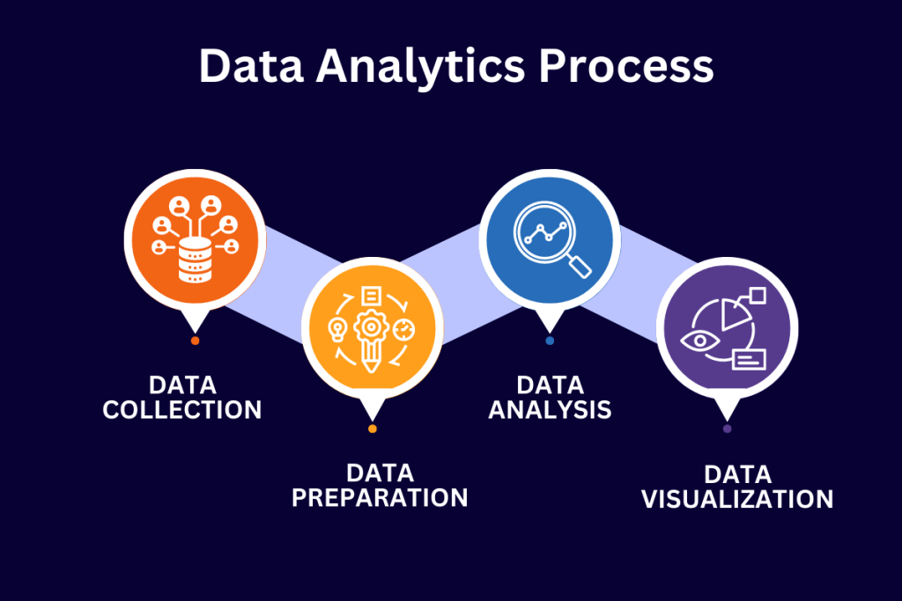

<h1 align="center"> Data Analytics: Siniestros viales en CABA

# Homicidios por siniestros viales en la Ciudad Autónoma de Buenos Aires, Argentina

## Introducción

En este proyecto toma el rol de un Data Analyst que forma parte del equipo de analistas de datos de una empresa consultora a la cual el **Observatorio de Movilidad y Seguridad Vial (OMSV)**, que es un centro de estudios que se encuentra bajo la órbita de la Secretaría de Transporte del Gobierno de la Ciudad Autónoma de Buenos Aires (CABA), les solicitó la elaboración de un proyecto de análisis de datos. 

El fin de este proyecto es generar información que le permita a las autoridades locales tomar medidas para disminuir la cantidad de víctimas fatales de los siniestros viales ocurridos en CABA. Para ello, se pone a disposición un dataset sobre homicidios en siniestros viales acaecidos en la Ciudad de Buenos Aires durante el periodo 2016-2021.

Se espera como productos finales un reporte de las tareas realizadas, metodologías adoptadas y principales conclusiones y la presentación de un dashboard interactivo que facilite la interpretación de la información y su análisis.

## Contexto

Los siniestros viales, también conocidos como accidentes de tráfico o accidentes de tránsito, son eventos que involucran vehículos en las vías públicas y que pueden tener diversas causas, como colisiones entre automóviles, motocicletas, bicicletas o peatones, atropellos, choques con objetos fijos o caídas de vehículos. Estos incidentes pueden tener consecuencias que van desde daños materiales hasta lesiones graves o fatales para los involucrados.

Los siniestros viales son una preocupación importante en la Ciudad de Buenos Aires, debido al alto volumen de tráfico y la densidad poblacional. Estos incidentes pueden tener un impacto significativo en la seguridad de los residentes y visitantes de la ciudad, así como en la infraestructura vial y los servicios de emergencia.

Actualmente, según el censo poblacional realizado en el año 2022, la población de CABA es de 3,121,707 de habitantes en una superficie de 200 $km^2$, lo que implica una densidad de aproximadamente 15,603 $hab/km^2$ ([Fuente](https://www.argentina.gob.ar/caba#:~:text=Poblaci%C3%B3n%3A%203.120.612%20habitantes%20(Censo%202022).)). Sumado a esto, en Noviembre de 2023 en el parque automotor de CABA se registraron 1,616,327 de vehículos transitando ([Fuente](https://www.estadisticaciudad.gob.ar/eyc/?p=41995)). Por lo que la prevención de siniestros viales y la implementación de políticas efectivas son esenciales para abordar este problema de manera adecuada.

## Datos

Para este proyecto se trabajó con la **Bases de Víctimas Fatales en Siniestros Viales** que se encuentra en formato de Excel y contiene dos pestañas de datos:

* **HECHOS**: que contiene una fila de hecho con id único y las variables temporales, espaciales y participantes asociadas al mismo.
* **VICTIMAS**: contiene una fila por cada víctima de los hechos y las variables edad, sexo y modo de desplazamiento asociadas a cada víctima. Se vincula a los HECHOS mediante el id del hecho.

En este [link](https://docs.google.com/spreadsheets/d/1nq00jGIZHQ1RLSET43zKnUsMsoFb-pBg/edit#gid=1625530738) se encuentran los datos utilizados en el análisis.

## Tecnologías utilizadas

Para la elaboración de este proyecto se utilizó Python y Pandas para los procesos de extracción, transformación y carga de los datos, como así también para el análisis exploratorio de los datos. En el siguiente apartado se describen los resultados del análisis.

Finalmente, para la construcción de un dashboard interactivo se utiliza Power BI, el cuál se puede consultar [aquí](https://github.com/Agusherbo/PI_DA_Siniestros-viales-BA/blob/main/Dashboard_PIDA/siniestros_viales_caba_AgustinH.pbix). 

## ETL y EDA

En primer lugar, se realizó un proceso de extracción, transformación y carga de los datos (ETL), tanto de "HECHOS" como "VÍCTIMAS", donde se estandarizaron nombres de las variables, se analizaron nulos y duplicados de los registros, se eliminaron columnas redundantes o con muchos valores faltantes, entre otras tareas. Una vez finalizado este proceso para los dos conjuntos de datos se procedió a unir los dos conjuntos en uno solo denominado `01_homicidios`.

En segundo lugar, se procedió a realizar un análisis exploratorio (EDA), con la finalidad de encontrar patrones que permitan generar información que le permita a las autoridades locales tomar medidas para disminuir la cantidad de víctimas fatales de los siniestros viales. Todos los detalles de este análisis se encuentran [aquí](https://github.com/Agusherbo/PI_DA_Siniestros-viales-BA/blob/main/01_ETL_EDA.ipynb).

## Análisis de los Datos

Lo primero que se analizó fue variable temporal, para entender la distribución de los homicidios en distintas escalas temporales. La distribución anual de la cantidad de víctimas fatales es de alrededor del 60% para los primeros 3 años del conjunto de datos, con una disminución marcada para el 2020 como consecuencia de la cuarentena por COVID 19. El comportamiento a lo largo del año, es decir, la variación mensual, si bien para todo el conjunto de datos es marcada, con un pico de víctimas en Diciembre, esta tendencia no se observa tan claramente entre los distintos años. Este resultado de la mayor cantidad de víctimas en Diciembre está influenciada por la flexibilización de las medidas tomadas por la cuarentena.

Luego, bajando en la escala temporal, se ve que el 70% de las victimas perdieron la vida en entre lunes y viernes, lo que haría pensar que se debe al traslado diario al trabajo. En la distribución semanal no se observan diferencias significativas entre los distintos días.

Si se analizan las franjas horarias, las mayores cantidad de victimas se presentaron en el horario entre las 6 a 8 de la mañana, lo que también hace pensar en el horario de ingreso a los trabajos. Pero si se analiza esta franja en particular, se observa quela mayor parte de estas víctimas resultaron de hechos ocurridos durante el fin de semana.

Lo siguiente que se hizo fue analizar el perfil de la víctima. En primero lugar se ve que el 77% de las víctimas son masculinas. El 52% de las víctimas se encuentran en un rango etario entre los 26 a 50 años de edad, de los cuales el 84% de ellos son masculinos. 

Si se observa que rol de la víctima, es decir la posición relativa que ocupaba al momento del hecho, el 48% era conductor. En particular, este 48% se distribuye en un 77% de víctimas que se movilizaban en moto y 19% en auto. En relación a la cantidad de víctimas según el medio de transporte al momento del hecho, el 42% de las víctimas son conductores de moto, de los cuales el 88% de los conductores de moto son masculino.

Por último, se buscaron patrones en la distribución espacial de los hechos. Lo que se destaca de este análisis, es que en todas las comunas de CABA se presenta como factor común los accidentes en las avenidas. El 71% de las víctimas perdió la vida en avenidas. En particular, en el 75% ocurro en un cruce. Esta es un comportamiento que se mantiene entre los distintos años.

## KPI

En función de lo analizado en el punto anterior, se plantearon dos objetivos en relación a la disminución de la cantidad de víctimas fatales de los siniestros viales, desde los cuales se proponen dos indicadores de rendimiento clave o KPI.

* *Reducir en un 10% la tasa de homicidios en siniestros viales de los últimos seis meses, en CABA, en comparación con la tasa de homicidios en siniestros viales del semestre anterior*

    Las tasas de mortalidad relacionadas con siniestros viales suelen ser un indicador crítico de la seguridad vial en una región. Se define como **Tasa de homicidios en siniestros viales** al número de víctimas fatales en accidentes de tránsito por cada 100,000 habitantes en un área geográfica durante un período de tiempo específico, en este caso se toman 6 meses. Su fórmula es:

    $\text{Tasa de homicidios en siniestros viales} = \frac{\text{Número de homicidios en siniestros viales}}{\text{Población total}}·100,000$

    Como *Población Total* se calculó la población para el año 2021 a partir del censo poblacional del 2022.

    En este caso, para el año 2021, la *Tasa de homicidios en siniestros viales* fue de 1.76 lo que significa que, durante los primeros 6 meses del año 2021, hubo aproximadamente 1.76 homicidios en accidentes de tránsito por cada 100,000 habitantes. Ahora, el objetivo planteado es reducir esta tasa para el siguiente semestre de 2021 en un 10%, esto es **1.59**. Cuando se calcula el KPI para este período se obtiene que la *Tasa de homicidios en siniestros viales* fue de **1.35**, lo que significa que para el segundo semestre de 2021 se cumple con el objetivo propuesto.

* *Reducir en un 7% la cantidad de accidentes mortales de motociclistas en el último año, en CABA, respecto al año anterior*

    Como se vio en el análisis exploratorio, el 42% de las víctimas mortales se transportaban en moto al momento del hecho. Por lo que se consideró importante proponer el monitoreo de la cantidad de accidentes mortales en este tipo de conductor. Para ello se define a la **Cantidad de accidentes mortales de motociclistas** como el número absoluto de accidentes fatales en los que estuvieron involucradas víctimas que viajaban en moto en un determinado periodo temporal. La fórmula para medir la evolución de los accidentes mortales con víctimas en moto es:

    $\text{Cantidad de accidentes mortales de motociclistas} = -\frac{\text{Víctimas moto año anterior - Víctimas moto año actual}}{\text{Víctimas moto año anterior}}·100$

    Donde:
    - $\text{Víctimas moto año anterior}$: Número de accidentes mortales con víctimas en moto en el año anterior
    - $\text{Víctimas moto año actual}$: Número de accidentes mortales con víctimas en moto en el año actual 

    Para este caso, se toma como año actual al año 2021 y como año anterior al año 2020. En primer lugar, se calculó la *Cantidad de accidentes mortales de motociclistas* para el año 2020, el cual resultó de -44.00, de esta manera el objetivo a cumplir es de **-40.92** (es decir, la reducción del 7% de la cantidad de accidentes para 2020). El calcular la *Cantidad de accidentes mortales de motociclistas* para el año 2021 resultó de **64.29** lo que significa que aumentó un 64% la cantidad de muertes de conductores de motociclistas respecto del 2020.

* *A continuación podemos ver los gráficos de los KPIs:*

  

## Conclusiones y recomendaciones

Entre los años 2016 a 2021 se registraron 714 víctimas fatales en accidentes de tránsito. El 70% de las víctimas se registraron durante la semana. En cuanto a la franja horaria, la mayoria los hechos ocurre entre las 6 y las 8 de la mañana, pero durante los fines de semana. Diciembre es el mes que resulta con el máximo de fallecimientos en el período analizado.

El 77% de las víctimas fatales fueron de sexo masculino, de los cuales casi el 52% tenía entre 26 y 50 años de edad. En relación al tipo de usuario, el 42% fueron motociclistas. El 71% de los homicidios ocurrió en algún punto de las avenidas de CABA, siendo el 75% de ellos en un cruce.

Finalmente, para el segundo semestre del año 2021, se cumplió con el objetivo de bajar la tasa de homicidios en siniestros viales, pero no se cumplieron los objetivos de reducir la cantidad de accidentes mortales en motociclistas ni en avenidas para el año 2021 respecto del año 2020.

En función de lo anterior, se hacen las siguientes recomendaciones:

* Continuar monitoreando los objetivos propuestos acompañados de campañas puntuales, en especial a conductores de motos y usuarios de las avenidas.
* Reforzar las campañas de seguridad vial entre los días viernes a lunes, intensificando particularmente en el mes de Diciembre.
* Puntualizar campañas de conducción segura en avenidas y cruces de calles.
* Dirigir las campañas de seguridad hacia el sexo masculino, especialmente en cuanto a conducción en moto.

## Herramientas del proyecto

# _Autor_
- Agustin Herbozo
- Mail: heerbozo@gmail.com
- Linkedin: [Linkedin](https://www.linkedin.com/in/agustin-herbozo-1a3b7111b/)
